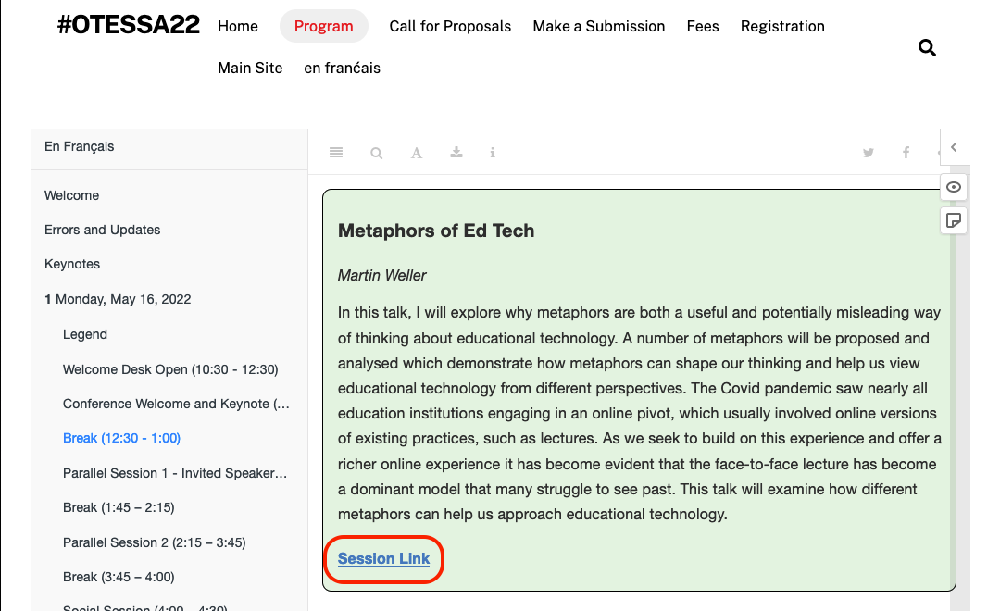
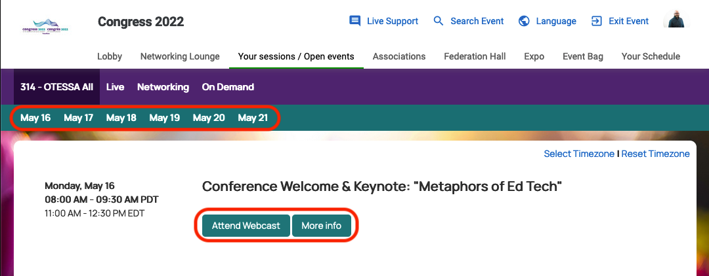
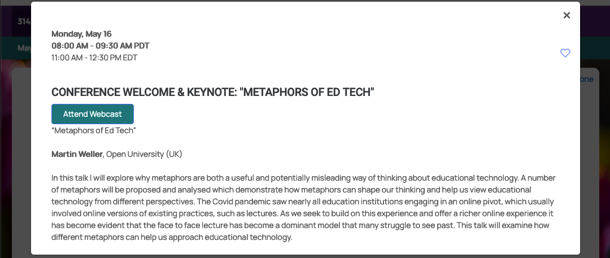
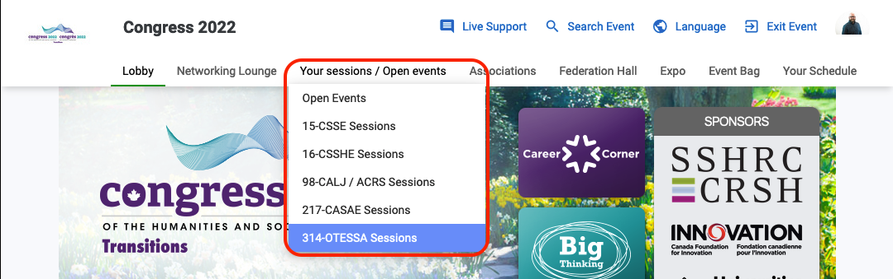
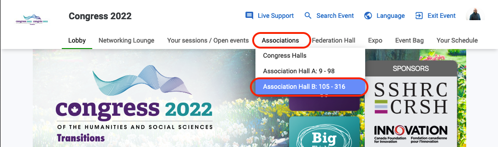
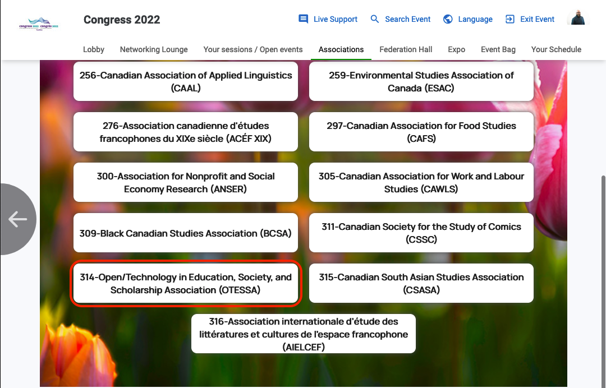
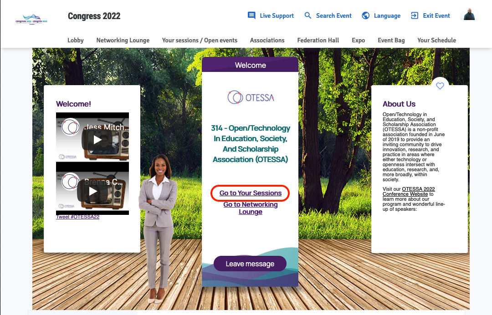

# Navigation and Presenter Information {-}

## Navigating Forj {-}
Forj is the Congress virtual platform, where you will find links to all Zoom sessions. Panelists and speakers and attendees will need to sign in to the platform and navigate to their event.

There are three ways to do this.

1. Follow the link from the **OTESSA Program**
2. From the Congress Homepage, go to the **Your Sessions / Open events** tab  
3. From the Congress Homepage, go to the **Associations tab**   

### **OPTION 1** {-}

In the bottom corner of each session on the [OTESSA Program page](https://otessa.org/2022/program), there is a 'Session Link', which will take you to the Events listing page in the Congress virtual platform. You may need to sign in.

Each session contains the same link to the Events listing page, so if you don't see one, pick another!

Find your date, and then select **Attend Webcast** or **More info**

- If you choose **Attend Webcast**, the Zoom session will launch  
- If you choose **More info**, select the **Attend Webcast** button in the popup to launch Zoom and join the session.  
  

### **OPTION 2** {-}
Go to **Your Sessions / Open events** tab and choose '314-OTESSA Sessions' from the dropdown menu.

You will also see that you have access to several other Associations' programs. We have reciprocal attendance agreements with these associations and you are welcome to attend their sessions as a paid OTESSA registrant.

Find your date, and then select **Attend Webcast** or **More info**

- If you choose **Attend Webcast**, the Zoom session will launch  
- If you choose **More info**, select the **Attend Webcast** button in the popup to launch Zoom and join the session.

### **OPTION 3** {-}

Hover over the **Associations** tab and choose **Association Hall B**.

OTESSA is **Association #314**.

Here you will be brought to the Greeting lounge. When you are in the Greeting lounge, click on “Go to your sessions”

Find your date, and then select **Attend Webcast** or **More info**

- If you choose **Attend Webcast**, the Zoom session will launch  
- If you choose **More info**, select the **Attend Webcast** button in the popup to launch Zoom and join the session.  
  

## Presenter Information {-}

Come event day presenters and moderators will be let into the green room of the session **15 minutes in advance** of the start time. We will have a designated event technician who will be the host of the session and we can ensure the appropriate folks are made cohosts for screen sharing or other purposes.  

The session will have a waiting room activated and attendees won’t be admitted until the session start time.

Forj support is available, and they are extremely helpful. It is important to note that no links will be sent to presenters, and that it is helpful and important that presenters look at the platform before the start of their session. Presenters will get access shortly.

Thanks!
