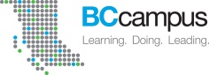
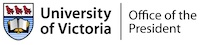
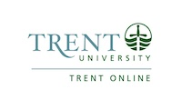

--- 
title: "Programme de la Conférence 2022 "
author: "Ouverture et Technologies en Éducation, dans la Société et pour l’avancement des Savoirs"
date: "dernière mise à jour `r Sys.Date()`"
site: bookdown::bookdown_site
output: bookdown::gitbook
documentclass: book
bibliography: [book.bib]
biblio-style: apalike
link-citations: yes
github-repo: otessa/2022fr
description: "Ouverture et Technologies en Éducation, dans la Société et pour l’avancement des Savoirs"
---

# Welcome {-}

Welcome to our searchable program. We will continue to update this site throughout the conference as changes arise.


```{block, type='protip'}

#### ✨ Remarque {-}

***Toutes les heures indiquées sont selon l’horaire de l’est (Québec, Canada)***
```


Tous les participants à OTESSA peuvent assister à la [série de causeries Voir grand](https://www.federationhss.ca/fr/congres/congres-2022/programme/programmation-ouverte){target="_blank"} de cette année ainsi qu’aux [autres évènements ouverts](https://www.federationhss.ca/fr/congres/congres-2022/calendrier-des-evenements-ouverts){target="_blank"} dans le calendrier. Ces évènements ont lieu chaque jour de la conférence. 

Tous les participants inscrits à la conference OTESSA peuvent aussi assister sans frais aux séances des associations suivantes :  la [Société Canadienne pour l’Étude de l’Éducation (SCÉÉ)](https://csse-scee.ca/fr){target="_blank"}, la [Société Canadienne pour l’Étude de l’Enseignement Supérieur (SCEES)](https://csshe-scees.ca/francais/){target="_blank"}, la [Association Canadienne des Revues Savantes (ACRS)](https://www.calj-acrs.ca/fr){target="_blank"} et l’[Association Canadienne pour l’Étude de l’Éducation des Adultes (ACÉÉA)](https://www.casae-aceea.ca/){target="_blank"} puisque nous avons conclu des ententes de réciprocité. Notez toutefois que les présentateurs doivent s’inscrire à chaque conférence où ils présentent une communication. 
 

Please note that presenters must register in each conference in which they are presenting. 


## Sponsors {-}

### Advocates {-}

[](https://www.ecampusontario.ca/){target="_blank"}  


### Partners {-}

[](https://www.campusmanitoba.ca/){target="_blank"}  

### Friends {-}

[](https://bccampus.ca){target="_blank"}  
<br>  

[](https://uvic.ca/education){target="_blank"}  
<br>

[](https://uvic.ca/president){target="_blank"}  
[](https://trentu.ca/online){target="_blank"}  

## Interaction Tips {-}

The toolbar at the top of the program allows you to customize your view of the program.


### Table of Contents {-}

Click the 'hamburger menu' to toggle open or close the table of contents.

### Search  {-}

Use the search tool to search the full text of the program, including presenters, keywords, titles, research/practice, and the full text of abstracts that are available at the time of the latest update. This feature will filter the Table of Contents so that only the pages containing your search terms will appear.

### Customize Text {-}

Use this tool to change the font size and style (serif/sans-serif), or to choose a White, Sepia, or Night (less recommended) theme.

### Downloads {-}

Each time we build the page, we will generate an up-to-date ePub document for download.

### Information {-}

Tips for navigating the program with your keyboard.

### Session Links {-}

In each session in the program, you will see a 'Session Link'. This link will take you to the Congress platform, where you will need to sign in and navigate to the specific day and session within that interface.