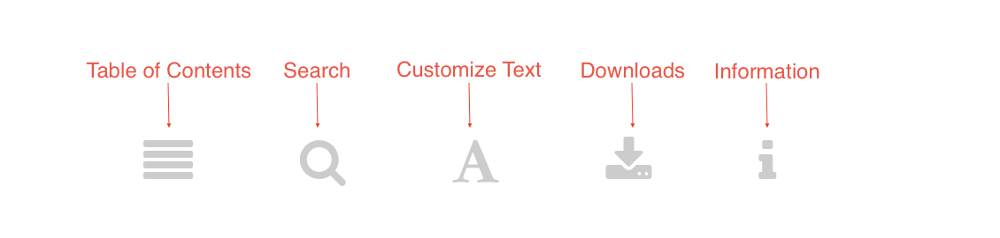

--- 
title: "OTESSA 2022 Program"
author: "Open Technology in Education, Society, and Scholarship Association"
date: "Last updated `r Sys.Date()`"
site: bookdown::bookdown_site
output: bookdown::gitbook
documentclass: book
bibliography: [book.bib]
biblio-style: apalike
link-citations: yes
github-repo: otessa/2022fr
description: "Open Technology in Education, Society, and Scholarship Association"
---

# Welcome {-}

Welcome to our searchable program. We will continue to update this site throughout the conference as changes arise.


```{block, type='protip'}

#### ✨ Note{-}

***All times are in Eastern Time (Canada)***
```


All OTESSA Participants can attend the [Congress “Big Thinking” lecture series](https://www.federationhss.ca/en/congress/congress-2022/open-programming). These take place each day of the conference. Congress has “[open events](https://www.federationhss.ca/en/congress/congress-2022/calendar-open-events)” available as well (open to registrants across association conferences at Congress as well as those who hold community passes).

All OTESSA Registrants can also attend conference sessions offered by the [Canadian Association for the Study of Education (CSSE)](https://csse-scee.ca/), [Canadian Association for the Study of Higher Education (CSSHE)](https://csshe-scees.ca/), [Canadian Association of Learned Journals (CALJ)](https://www.calj-acrs.ca/), and [Canadian Association for the Study of Adult Education (CASAE)](https://www.casae-aceea.ca/) as we have reciprocity agreements in place. 

Please note that presenters must register in each conference in which they are presenting. 

## Interaction Tips {-}

The toolbar at the top of the program allows you to customize your view of the program.



### Table of Contents {-}

Click the 'hamburger menu' to toggle open or close the table of contents.

### Search  {-}

Use the search tool to search the full text of the program, including presenters, keywords, titles, research/practice, and the full text of abstracts that are available at the time of the latest update. This feature will filter the Table of Contents so that only the pages containing your search terms will appear.

### Customize Text {-}

Use this tool to change the font size and style (serif/sans-serif), or to choose a White, Sepia, or Night (less recommended) theme.

### Downloads {-}

Each time we build the page, we will generate an up-to-date ePub document for download.

### Information {-}

Tips for navigating the program with your keyboard.